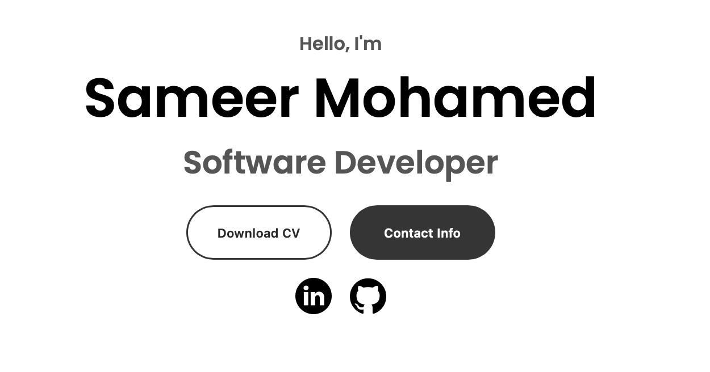

# Sameer Mohamed - Portfolio Website



## Table of Contents

- [About the Project](#about-the-project)
- [Live Demo](#live-demo)
- [Features](#features)
- [Technologies Used](#technologies-used)
- [Installation](#installation)
- [Contributing](#contributing)
- [Contact](#contact)
- [License](#license)

---

## About the Project

This is my personal portfolio website, built to showcase my skills, projects, and experience. The website includes sections about myself, my background, professional experience and a downloadable resume.

## Live Demo

You can view the live version of the portfolio here:

🔗 [**Live Portfolio**](https://sameer3108.github.io/sameer3108.github.io/)

## Features

- **Responsive Design**: The website is fully responsive, making it accessible on a variety of screen sizes, from mobile devices to large desktops.
- **Work Experience**: A timeline showcasing my professional experiences and roles.
- **Downloadable Resume**: A section where visitors can download my resume in PDF format.
- **Contact Information**: Easy access to my contact details and social profiles.

## Technologies Used

This project was built using modern web development technologies:

- **HTML5**: For structuring the content.
- **CSS3**: For styling and making the site responsive.
- **JavaScript**: For interactive elements and client-side logic.
- **GitHub Pages**: For hosting the website.

## Installation

To run this project locally, follow these steps:

1. Clone the repository:
   ```bash
   git clone https://github.com/sameer3108/sameer3108.github.io.git
